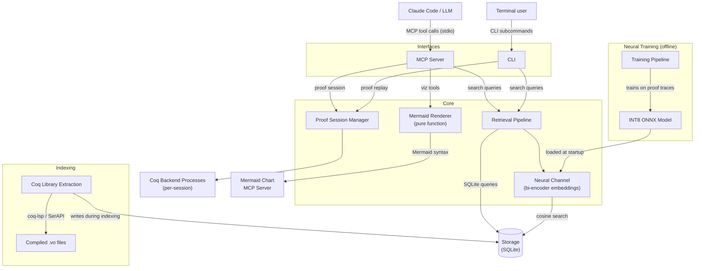

# Development

## Architecture



The search subsystem (Retrieval Pipeline + Storage), proof interaction subsystem (Proof Session Manager + Coq Backend Processes), and visualization subsystem (Mermaid Renderer) are independent at runtime. The neural channel is optional — when no model checkpoint is available, the pipeline operates with symbolic channels only. The Mermaid Renderer is a pure function component with no external dependencies — it generates Mermaid syntax text that the Mermaid Chart MCP server renders into images.

### Retrieval Channels

| Channel | Method | Use Case |
|---------|--------|----------|
| WL Kernel | Weisfeiler-Lehman histogram cosine similarity | Fast structural screening (100K -> 500 candidates) |
| MePo | Iterative symbol-relevance with inverse-frequency weighting | Symbol-based discovery |
| FTS5 | SQLite full-text search with BM25 | Name and text matching |
| TED | Zhang-Shasha tree edit distance | Fine structural ranking (≤ 50 nodes) |
| Const Jaccard | Jaccard similarity of constant name sets | Lightweight complement |
| Neural | Bi-encoder cosine similarity (INT8 ONNX) | Learned semantic relevance |

Channels are combined via:
- **Fine-ranking weighted sum** for `search_by_structure`
- **Reciprocal Rank Fusion** (k=60) for `search_by_type` (includes neural channel when available)

## Project Structure

```
src/poule/
├── models/          # Core data types (labels, trees, enums, responses)
├── normalization/   # Coq term normalization + CSE
├── storage/         # SQLite read/write layer
├── channels/        # Retrieval channels (WL, MePo, FTS, TED, Jaccard)
├── fusion/          # Score fusion (weighted sum, RRF, collapse match)
├── pipeline/        # Query orchestration
├── extraction/      # Offline .vo file extraction
├── session/         # Proof session manager, types, errors
├── serialization/   # Proof state JSON serialization + diff computation
├── rendering/       # Mermaid diagram generation (proof state, tree, deps, sequence)
├── neural/          # Neural premise selection
│   ├── encoder.py       # ONNX Runtime encoder interface
│   ├── index.py         # Brute-force cosine search over embeddings
│   ├── channel.py       # Neural retrieval channel + availability checks
│   ├── embeddings.py    # Embedding write/read paths
│   └── training/        # Training pipeline (data, trainer, evaluator, quantizer, validator)
├── server/          # MCP server (handlers, validation, errors)
└── cli/             # CLI commands and output formatting
```

## Running Tests

```bash
# Run all tests
uv run pytest

# Run tests for a specific module
uv run pytest test/test_data_structures.py -v

# Run with coverage
uv run pytest --cov=poule

# Skip tests requiring Coq installation
uv run pytest -m "not requires_coq"
```

## Publishing Releases

Prebuilt search indexes and neural model checkpoints are distributed via [GitHub Releases](https://github.com/ekirton/poule/releases). Users can download them with `uv run python -m poule.cli download-index` instead of building from source.

### When to publish

Publish a new release when any of these change:
- Coq version (new stdlib declarations)
- MathComp version (new library content)
- Index schema version (storage layer changes)
- Neural model (retrained or improved checkpoint)

### Prerequisites

- [`gh`](https://cli.github.com/) CLI, authenticated (`gh auth login`)
- `sqlite3` (reads version metadata from the index)
- `shasum` (computes checksums)

### Publishing

1. Build the index:

```bash
uv run python -m poule.extraction --target stdlib+mathcomp --db index.db --progress
```

2. Publish with the index only:

```bash
./scripts/publish-release.sh index.db
```

3. Or include the neural model:

```bash
./scripts/publish-release.sh index.db --model path/to/neural-premise-selector.onnx
```

The script reads `schema_version`, `coq_version`, and `mathcomp_version` from the database's `index_meta` table, computes SHA-256 checksums, generates a `manifest.json`, and creates a tagged release. The tag format is `index-v{schema}-coq{coq_version}-mc{mathcomp_version}` (e.g., `index-v1-coq8.19-mc2.2.0`).

### Release assets

| Asset | Description |
|-------|-------------|
| `index.db` | SQLite search index |
| `manifest.json` | Version metadata and SHA-256 checksums |
| `neural-premise-selector.onnx` | INT8 ONNX model (optional) |

The download client (`src/poule/cli/download.py`) fetches `manifest.json` first, then downloads assets and verifies checksums before placing files. See [`specification/prebuilt-distribution.md`](specification/prebuilt-distribution.md) for the full protocol.

## Documentation Layers

| Layer | Location | Purpose |
|-------|----------|---------|
| Requirements | `doc/requirements/` | Business goals, user needs |
| Features | `doc/features/` | What and why |
| Architecture | `doc/architecture/` | How (language-agnostic design) |
| Specifications | `specification/` | Implementable contracts |
| Tasks | `tasks/` | Detailed implementation plans |
